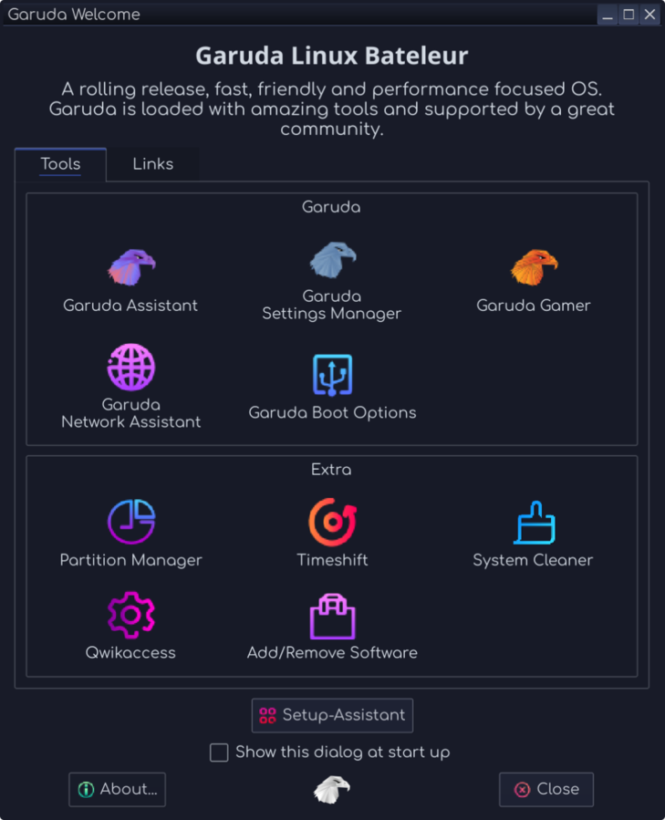
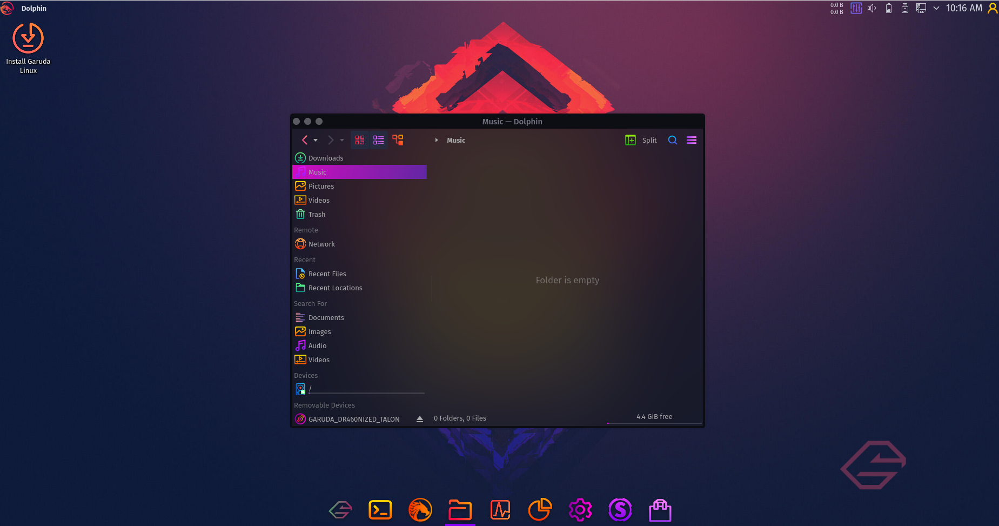
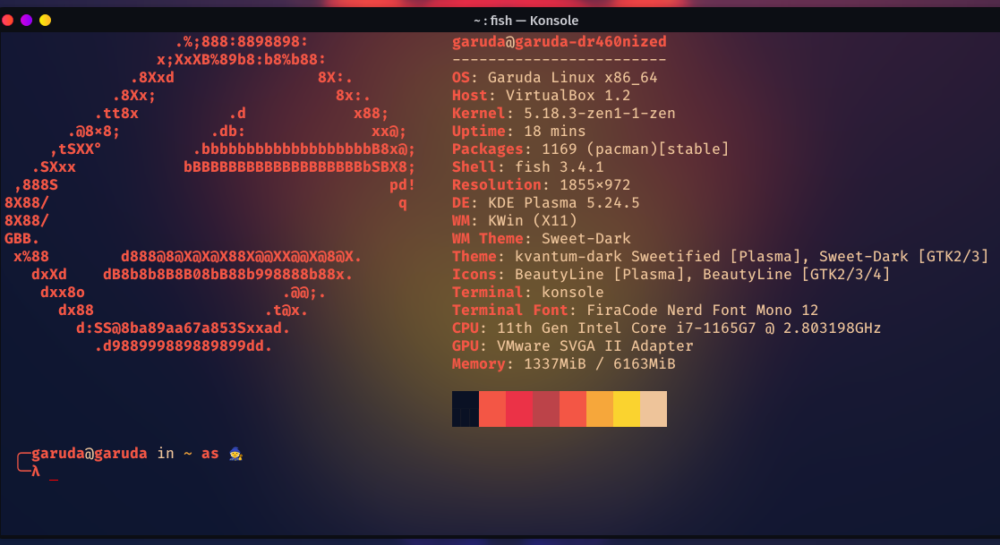
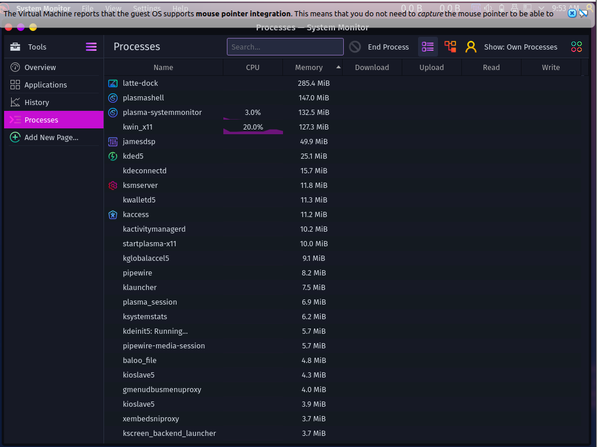
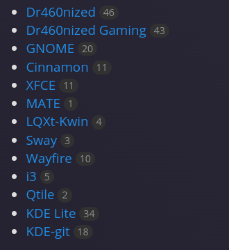
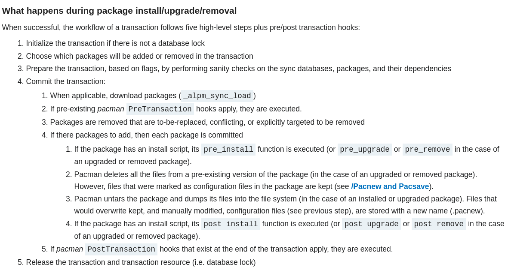
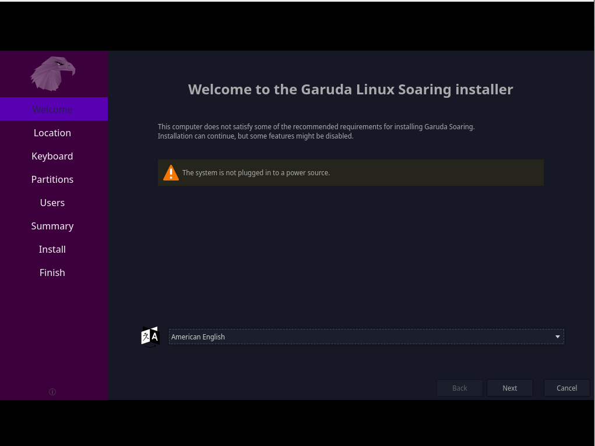

# Garuda Linux

<!-- image added -->


## Introduction

Garuda Linux is a Linux distribution based on the Arch Linux operating system. Garuda Linux is available in wide range of popular Linux desktop environments. It features a rolling release update model using Pacman/Pamac as its package manager. 
The term Garuda, which originates from Hinduism, is defined as a divine eagle-like sun bird and the king of birds.

Garuda Linux was released on the 26 March 2020. Garuda Linux is developed and maintained by developers around the world. It was founded by Shrinivas Vishnu Kumbhar (India, Lead Founder) and SGS (Germany, Founder)



### modern file-system
BTRFS is a modern, Copy-on-Write (CoW) filesystem for Linux, aimed at implementing advanced features while also focusing on fault tolerance, repair and easy administration. 


combined with with zstd compression it places emphasis on performance, fault tolerance, and seamless administration. The filesystem significantly minimizes the chances of data corruption.

The BTRFS filesystem integrates with snapper to provide an automatic snapshot feature that backup the entire system before every system update.

### beatiful UI and smoth UX


### Easy installation
making the installation process simple by using the Calamares installer, which is both fast and easy to use. More about installation later...

### Chaotic-AUR: AUR (Arch User Repository)
Garuda uses Chaotic-AUR as repository featuring one of the bigger precompiled software choices out there out of the box. Among the selection of software are a lot of emulators, kernels, games, themes and other commonly used tools - around 2400 packages right now!

### A privacy-friendly yet usable browser based on LibreWolf (FireDragon)
Have their own browser, FireDragon which is forked from LibreWolf. Amongst its features are privacy-friendly defaults, enhanced KDE integration and a small collection of useful addons. The default search engine is SearX instance run on the server.

## system requirements

Garuda Linux hardware requirements vary on the Desktop Environment used, but are very similar.


Minimum requirements:
* 30 GB storage
* 4 GB RAM

Recommended requirements:
* 40 GB storage
* 8 GB RAM

Garuda Linux also requires a thumbdrive that contains 4 GB space for their standard versions. Gaming Desktop Environments require a thumbdrive with 8 GB storage space available.


## Usage


https://technical-news.net/garuda-linux-young-arch-derivative-puts-the-focus-on-games-and-performance1613987474

The young Linux distribution 'Garuda Linux' is cutting edge as an Arch derivative and focuses primarily on **games** and **performance**. In addition to its easy-to-use graphical installer, which significantly simplifies installation, the free operating system offers various desktop environments and window managers as well as gadgets.

The little Indian operating system , whose development team is also home to two German programmers, offers besides the well-known'Large' desktop environments Gnome, KDE Plasma , Xfce as well as LXQt and Deepin include the resource-saving window managers i3 and Wayfire, making distribution flexible.

Gadgets and tools like the Avant Window Navigator ('AWN'), a program dock in the style of macOS, and Conky, a program for desktop widgets, are intended to enhance the desktop and provide improved ergonomics.

All relevant system information, such as CPU, RAM and HDD/SSD utilization can be displayed directly on the work surface with 'Garuda Linux' and thus kept in view at all times.

* Rolling Release: Garuda Linux is a rolling release distro based on Arch Linux, which ensures always getting the latest software updates.
They only use one extra repo on top of Arch Linux repos, placing us very close to Arch Linux without having to install the system via command line.

* Linux-zen: A faster, more-responsive Linux kernel optimized for desktop, multimedia and gaming.
Result of a collaborative effort of kernel hackers to provide the best Linux kernel possible for everyday systems.

* Ease of Use: using micro as the default, terminal-based text editor that aims to be easy to use and intuitive, while taking advantage of the capabilities of modern terminals. install micro using <`curl https://getmic.ro | bash`>.
Garuda Linux offers you various GUI tools for managing system settings out of the box to make your jumpstart easier.

* Always Free: Garuda Linux will always remain free and open source. Its source code is currently hosted on GitLab and is open to contributions. Everyone has right to copy, compile, study, modify and redistribute the source code. We create it to have a Linux-based operating system that is easy to use and beautiful.

## derivatives

Garuda Linux KDE comes in three variants; Dragonized, Dragonized Gaming and Dragonized BlackArch (Removed).

Garuda Linux GNOME features Garuda Linux's own customized dark theme and light theme of GNOME.

Garuda Linux Xfce, which features Garuda Linux's own dark theme and light theme of Xfce.

Garuda Linux LXQt-kwin, which features Garuda Linux's own dark theme and light theme of LXQt-kwin.

Garuda Linux Wayfire, which features Garuda Linux's own dark theme and light theme of Wayfire.

Garuda Linux Qtile, which features Garuda Linux's own dark theme and light theme of Qtile.

Garuda Linux i3wm, which features Garuda Linux's own dark theme and light theme of i3wm.

Garuda Linux Sway, which features Garuda Linux's own dark theme and light theme of Sway.

Community Editions of Garuda Linux as Garuda Linux Mate & Garuda Linux Cinnamon also exists.



Garuda Linux comes with an option called Barebones for advanced users. It's meant for users who do not want extra software and functionalities. Barebones KDE and GNOME have minimum packages that allow the Operating System to run simple functionalities. Garuda Linux does not provide any support for Barebone users, as the user has the liberty to control their Linux distribution. Garuda Linux provides multiple environments, but the ISO's are packed with either one of the environments only. Others can be installed manually.

## License
Nobody should be restricted by the software they use. There are four freedoms that every user should have:

* the freedom to use the software for any purpose,
* the freedom to change the software to suit your needs,
* the freedom to share the software with your friends and neighbors, and
* the freedom to share the changes you make.


Developers who write software can release it under the terms of the GNU GPL. When they do, it will be free software and stay free software, no matter who changes or distributes the program. We call this copyleft: the software is copyrighted, but instead of using those rights to restrict users like proprietary software does, we use them to ensure that every user has freedom.


last update of the GPL to protect its copyleft from being undermined by legal or technological developments. The most recent version protects users from three recent threats:

* Tivoization: Some companies have created various different kinds of devices that run GPLed software, and then rigged the hardware so that they can change the software that's running, but you cannot. If a device can run arbitrary software, it's a general-purpose computer, and its owner should control what it does. When a device thwarts you from doing that, we call that tivoization.

* Laws prohibiting free software: Legislation like the Digital Millennium Copyright Act and the European Union Copyright Directive make it a crime to write or share software that can break DRM (Digital Restrictions Management; see below). These laws should not interfere with the rights the GPL grants you.

* Discriminatory patent deals: Microsoft has recently started telling people that they will not sue free software users for patent infringement—as long as you get the software from a vendor that's paying Microsoft for the privilege. Ultimately, Microsoft is trying to collect royalties for the use of free software, which interferes with users' freedom. No company should be able to do this.

https://www.gnu.org/licenses/quick-guide-gplv3.html

https://www.gnu.org/licenses/gpl-3.0.html


## Package Management

Pacman is a package manager that is capable of resolving dependencies and automatically downloading and installing all necessary packages. It is primarily developed and used by Arch Linux and its derivatives.


### rolling release update model 
Rolling release, rolling update, or continuous delivery, in software development, is the concept of frequently delivering updates to applications. This is in contrast to a standard or point release development model which uses software versions that must be reinstalled over the previous version.[clarification needed] An example of this difference would be the multiple versions of Ubuntu Linux versus the single, constantly updated version of Arch Linux. 

### pacman
The pacman package manager is one of the major distinguishing features of Arch Linux. It combines a simple binary package format with an easy-to-use build system. The goal of pacman is to make it possible to easily manage packages, whether they are from the official repositories or the user's own builds.

Pacman keeps the system up-to-date by synchronizing package lists with the master server. This server/client model also allows the user to download/install packages with a simple command, complete with all required dependencies.

Pacman is written in the C programming language and uses the bsdtar(1) tar format for packaging.

https://www.digitalocean.com/community/tutorials/how-to-use-arch-linux-package-management

#### how does pacman work?

Following link is very helpful to understand how pacman works.

https://wiki.archlinux.org/title/pacman#:~:text=The%20pacman%20package%20manager%20is,or%20the%20user's%20own%20builds.



## Installation and Configuration


The official Garuda Linux website supplies ISO images that can be run using a USB which contains 4 GB/8 GB of storage space, depending on the ISO image chosen. After the user has their partitions and formats set up on their drive, they can insert the thumbdrive and boot into it from the BIOS. Calamares will begin its process and present the user with a GUI installer.

Garuda Linux uses a rolling release update model in which new packages are supplied throughout the day. Pacman, the package manager, allows users to easily update their system.

Garuda Linux installation process is done with Calamares, a graphical installer. The rolling release model means that the user does not need to upgrade/reinstall the whole operating system to keep it up-to-date inline with the latest release. Package management is handled by Pacman via command line, and front-end UI package manager tools such as the pre-installed Pamac. It can be configured as either a stable system (default) or bleeding edge in line with Arch. Garuda Linux includes colorized UI which comes in various options, with the option to further customize the user preferences.


You can also use https://gitlab.com/garuda-linux/applications/garuda-downloader as garuda downloaded iso.

Then you can use the following command to Donwload the ISO image or format usb drive.

``` bash
 chmod +x Garuda_Downloader-x86_64.AppImage
 ./Garuda_Downloader-x86_64.AppImage
```

Garuda Downloader is a user-friendly ISO downloader focusing on saving bandwidth via delta downloads by utilizing zsync2. It provides an easy UI for downloading the latest (official, not development) live images of all official editions. On Linux, you can manually select an older ISO file as a "seed" file in order to save bandwidth.
After an ISO file has been downloaded, it provides a button to quickly launch a recommended flashing tool (Etcher on Linux, Rufus on Windows (only because the Rufus executable is tiny)). This is the recommended way to download Garuda Linux.

more info: 
https://forum.garudalinux.org/t/garuda-downloader-a-zsync-enabled-delta-downloader-for-garuda-linux-iso-files/6224

## Applications in Iran and the World
Garuda Linux is a truly fantastic, and easy-to-use rolling distribution that focuses not only on improved performance but also the look and feels. It's designed for users who prefer a colorful and inspiring user interface and gamers as well given its sheer magnitude of gaming software and tools. 
 

In Iran, same as the rest of the world, Garuda Linux is a great distribution for users who want to use a desktop environment that is easy to use and has a clean and modern look. It manages interactive tasks more easily than other distributions, and it is easy to use.

## hosting

Fosshost is supporting garuda linux with practical, free hosting solutions. The world runs on open source software, and they provide robust hosting solutions to make sure it stays that way. What's more, they do it all completely free of charge.

https://fosshost.org/


## references

https://gitlab.com/garuda-linux

https://en.wikipedia.org/wiki/Garuda_Linux

https://technical-news.net/garuda-linux-young-arch-derivative-puts-the-focus-on-games-and-performance1613987474

https://garudalinux.org/

https://linoxide.com/reasons-to-use-garuda-linux/#:~:text=Garuda%20provides%20a%20GUI%20assistant,and%20perform%20other%20diagnostic%20tasks.


