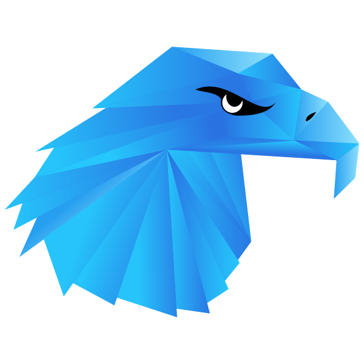
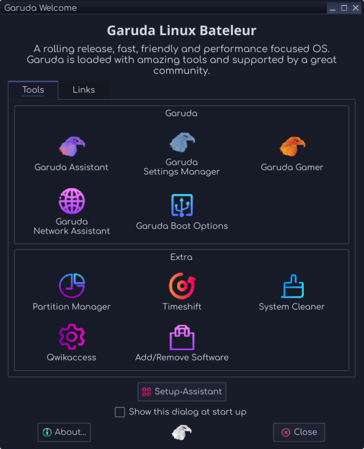
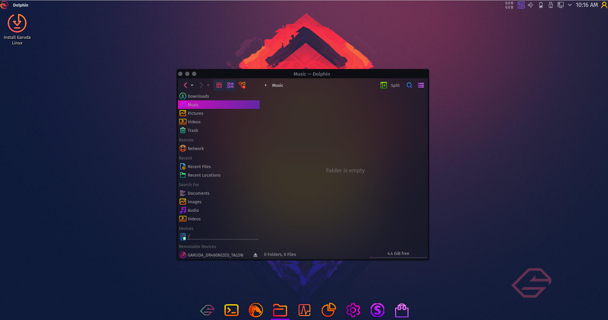
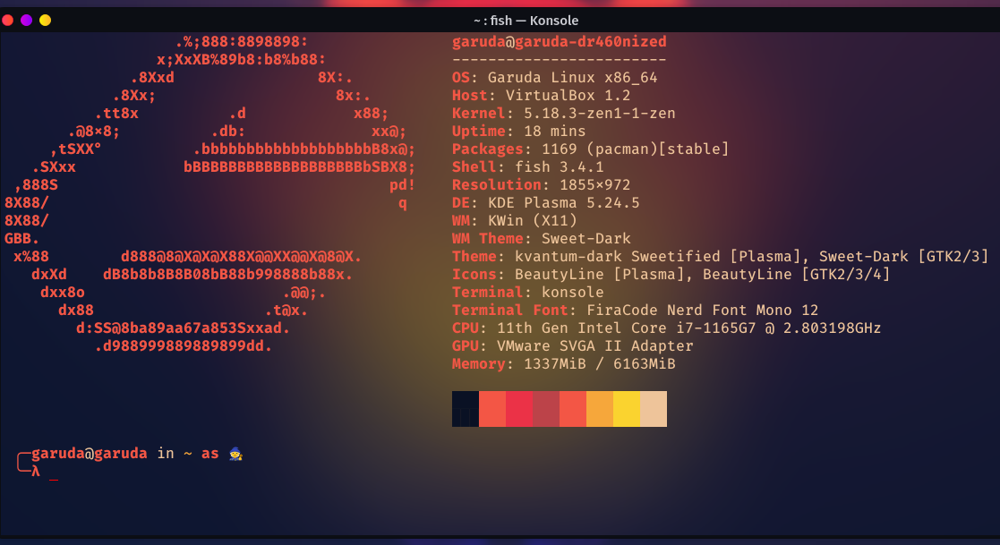
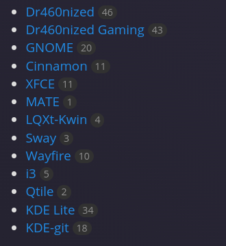
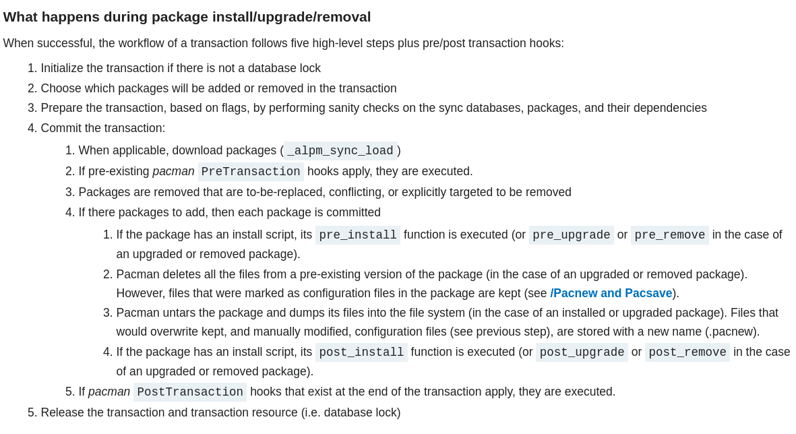
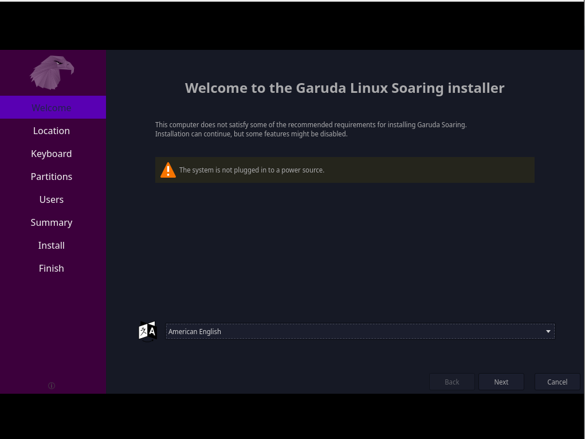

# Garuda Linux


<!-- image added -->



## تعریف و تشریح ابتدایی

<div dir="rtl">
Garuda Linux یک توزیع لینوکس بر اساس سیستم عامل Arch Linux است. Garuda Linux در طیف گسترده ای از محیط های محبوب دسکتاپ لینوکس در دسترس است. این دارای یک مدل به روز رسانی رولینگ است که از Pacman/Pamac به عنوان مدیر بسته خود استفاده می کند. 
</div>

<div dir="rtl">
اصطلاح گارودا که از هندوئیسم سرچشمه می گیرد، به عنوان پرنده خورشیدی عقاب مانند الهی و پادشاه پرندگان تعریف می شود.
</div>

<div dir="rtl">
Garuda Linux در 26 مارس 2020 منتشر شد. Garuda Linux توسط توسعه دهندگان در سراسر جهان توسعه یافته و نگهداری می شود. توسط Shrinivas Vishnu Kumbhar (هند، بنیانگذار اصلی) و SGS (آلمان، بنیانگذار) تأسیس شد.
</div>

######


<div dir="rtl">

### فایل سیستم مدرن
</div>

<div dir="rtl">
BTRFS یک سیستم فایل مدرن و کپی روی نوشتن (CoW) برای لینوکس است که با هدف پیاده‌سازی ویژگی‌های پیشرفته و همچنین تمرکز بر تحمل خطا، تعمیر و مدیریت آسان است.
</div>

#####



همراه با فشرده سازی zstd، بر عملکرد، تحمل خطا و مدیریت بدون درز تأکید دارد. سیستم فایل به طور قابل توجهی احتمال خراب شدن داده ها را به حداقل می رساند.

سیستم فایل BTRFS با snapper یکپارچه می شود تا یک ویژگی عکس فوری خودکار ارائه دهد که از کل سیستم قبل از هر به روز رسانی سیستم نسخه پشتیبان تهیه می کند.

### رابط کاربری زیبا و نرم 


### نصب آسان
با استفاده از نصب کننده Calamares که استفاده از آن سریع و آسان است، فرآیند نصب را ساده کنید. اطلاعات بیشتر در مورد نصب در آینده ...

###  استفاده از Chaotic-AUR
<div dir="rtl">
Garuda از Chaotic-AUR به عنوان مخزن استفاده می کند که یکی از بزرگترین نرم افزار از پیش کامپایل شده را دارد. در میان منتخب نرم‌افزارها، شبیه‌سازها، هسته‌ها، بازی‌ها، تم‌ها و سایر ابزارهای رایج وجود دارد - در حال حاضر حدود 2400 بسته!

### یک مرورگر سازگار با حریم خصوصی و در عین حال قابل استفاده مبتنی بر LibreWolf (FireDragon)
<div dir="rtl">
 FireDragon که از LibreWolf فورک شده است. از جمله ویژگی‌های آن می‌توان به پیش‌فرض‌های سازگار با حریم خصوصی، ادغام پیشرفته KDE و مجموعه کوچکی از افزونه‌های مفید اشاره کرد. موتور جستجوی پیش‌فرض نمونه SearX است.


## کاربرد 


https://technical-news.net/garuda-linux-young-arch-derivative-puts-the-focus-on-games-and-performance1613987474
<div dir="rtl">
توزیع جوان لینوکس "Garuda Linux" به عنوان یک مشتق Arch در حال پیشرفت است و عمدتا بر روی **بازی** و **عملکرد** تمرکز دارد. این سیستم عامل رایگان علاوه بر نصب کننده گرافیکی با کاربری آسان، که نصب را به طور قابل توجهی ساده می کند، محیط های مختلف دسکتاپ و مدیران پنجره و همچنین گجت ها را ارائه می دهد.


<div dir="rtl">
سیستم عامل کوچک هندی که تیم توسعه آن نیز خانه دو برنامه نویس آلمانی است، علاوه بر محیط های دسکتاپ معروف "Large"، Gnome، KDE Plasma، Xfce و همچنین LXQt و Deepin شامل مدیریت پنجره های ذخیره کننده منابع i3 و Wayfire نیز می شود. ، توزیع را انعطاف پذیر می کند.

<div dir="rtl">
ابزارها و ابزارهایی مانند Avant Window Navigator ("AWN")، یک داک برنامه به سبک macOS، و Conky، برنامه ای برای ویجت های دسکتاپ، برای بهبود دسکتاپ و ارائه ارگونومی بهبود یافته در نظر گرفته شده اند.


<div dir="rtl">
تمام اطلاعات مربوط به سیستم، مانند استفاده از پردازنده، رم و HDD/SSD را می توان مستقیماً روی سطح کار با «گارودا لینوکس» نمایش داد و بنابراین همیشه در معرض دید قرار گرفت.

<div dir="rtl">
* انتشار رول / roll release: گارودا لینوکس یک توزیع در حال انتشار مبتنی بر آرچ لینوکس است که تضمین می کند همیشه آخرین به روز رسانی های نرم افزار را دریافت کنید.
آنها فقط از یک مخزن اضافی در بالای مخازن آرچ لینوکس استفاده می کنند و ما را بدون نیاز به نصب سیستم از طریق خط فرمان، به آرچ لینوکس بسیار نزدیک می کند.

<div dir="rtl">
* Linux-zen: یک هسته لینوکس سریعتر و پاسخگوتر که برای دسکتاپ، چند رسانه ای و برای بازی بهینه شده است.
نتیجه تلاش مشترک هکرهای هسته برای ارائه بهترین هسته لینوکس ممکن برای سیستم های روزمره این است.


<div dir="rtl">
* سهولت استفاده: استفاده از میکرو به عنوان ویرایشگر متنی پیش‌فرض مبتنی بر ترمینال که هدف آن آسان بودن و بصری بودن، در عین بهره‌گیری از قابلیت‌های پایانه‌های مدرن است. نصب میکرو با استفاده از <`curl https://getmic.ro | bash`>.
Garuda Linux ابزارهای رابط کاربری گرافیکی مختلفی را برای مدیریت تنظیمات سیستم به صورت خارج از جعبه به شما ارائه می دهد تا شروع کار شما را آسان تر کند.


<div dir="rtl">
* همیشه رایگان: Garuda Linux همیشه رایگان و منبع باز باقی می ماند. کد منبع آن در حال حاضر در GitLab میزبانی می شود و برای مشارکت باز است. هر کس حق دارد کد منبع را کپی، کامپایل، مطالعه، اصلاح و توزیع مجدد کند. ما آن را ایجاد می کنیم تا یک سیستم عامل مبتنی بر لینوکس داشته باشیم که استفاده از آن آسان و زیبا باشد.

</div>

## derivatives

Garuda Linux KDE در سه نوع ارائه می شود. Dragonized، Dragonized Gaming و Dragonized BlackArch (حذف شده).

Garuda Linux GNOME دارای تم تیره سفارشی شده و تم روشن گنوم توسط Garuda Linux است.

Garuda Linux Xfce، که دارای تم تیره و تم روشن Xfce خود Garuda Linux است.

Garuda Linux LXQt-kwin، که دارای تم تاریک خود Garuda Linux و تم روشن LXQt-kwin است.

Garuda Linux Wayfire، که دارای تم تاریک و تم روشن Wayfire است.

Garuda Linux Qtile، که دارای تم تاریک و تم روشن Qtile است.

Garuda Linux i3wm که دارای تم تاریک و تم روشن i3wm Garuda Linux است.

Garuda Linux Sway، که دارای تم تاریک و تم روشن Sway Garuda Linux است.

نسخه های community گارودا لینوکس به عنوان Garuda Linux Mate و Garuda Linux Cinnamon نیز وجود دارد.




<div dir="rtl">
Garuda Linux دارای گزینه ای به نام Barebones برای کاربران پیشرفته است. این برای کاربرانی است که نرم افزار و قابلیت های اضافی نمی خواهند. Barebones KDE و GNOME دارای حداقل بسته هایی هستند که به سیستم عامل اجازه می دهد تا عملکردهای ساده را اجرا کند. Garuda Linux هیچ پشتیبانی برای کاربران Barebone ارائه نمی دهد، زیرا کاربر این اختیار را دارد که توزیع لینوکس خود را کنترل کند. Garuda Linux چندین محیط را فراهم می کند، اما ISO ها فقط با یکی از محیط ها بسته بندی می شوند. بقیه را می توان به صورت دستی نصب کرد.

## License
هیچ کس نباید توسط نرم افزاری که استفاده می کند محدود شود. چهار آزادی وجود دارد که هر کاربر باید داشته باشد:

* آزادی استفاده از نرم افزار برای هر منظوری،
* آزادی تغییر نرم افزار مطابق با نیازهای شما،
* آزادی به اشتراک گذاری نرم افزار با دوستان و همسایگان خود و
* آزادی برای به اشتراک گذاشتن تغییراتی که ایجاد می کنید.


توسعه دهندگانی که نرم افزار می نویسند می توانند آن را تحت شرایط GNU GPL منتشر کنند. وقتی آنها این کار را انجام دهند، نرم افزار رایگان خواهد بود و نرم افزار آزاد باقی می ماند، مهم نیست چه کسی برنامه را تغییر داده یا توزیع می کند. ما این را کپی لفت می نامیم: نرم افزار دارای حق چاپ است، اما به جای استفاده از این حقوق برای محدود کردن کاربران مانند نرم افزارهای اختصاصی، از آنها استفاده می کنیم تا اطمینان حاصل کنیم که هر کاربر آزادی دارد.


آخرین به روز رسانی GPL برای محافظت از کپی لفت آن در برابر تضعیف شدن توسط پیشرفت های قانونی یا فناوری. جدیدترین نسخه از کاربران در برابر سه تهدید اخیر محافظت می کند:

<div dir="rtl">
* Tivoization: برخی از شرکت‌ها انواع مختلفی از دستگاه‌ها را ایجاد کرده‌اند که نرم‌افزار GPLed را اجرا می‌کنند، و سپس سخت‌افزار را تقلب کرده‌اند تا بتوانند نرم‌افزار در حال اجرا را تغییر دهند، اما شما نمی‌توانید. اگر دستگاهی بتواند نرم افزار دلخواه را اجرا کند، یک کامپیوتر همه منظوره است و مالک آن باید کارهایی را که انجام می دهد کنترل کند. هنگامی که دستگاهی شما را از انجام این کار منع می کند، به آن تیوویزاسیون می گوییم.


<div dir="rtl">
* قوانین منع نرم افزار آزاد: قوانینی مانند قانون حق نسخه برداری هزاره دیجیتال و دستورالعمل حق نسخه برداری اتحادیه اروپا، نوشتن یا به اشتراک گذاری نرم افزارهایی را که می تواند DRM (مدیریت محدودیت های دیجیتالی، زیر را ببینید) یک جرم محسوب می شود. این قوانین نباید با حقوقی که GPL به شما اعطا می کند تداخل داشته باشد.


<div dir="rtl">
* معاملات تبعیض آمیز ثبت اختراع: مایکروسافت اخیراً شروع به گفتن به مردم کرده است که از کاربران نرم افزار آزاد به دلیل نقض حق اختراع شکایت نمی کنند - تا زمانی که نرم افزار را از فروشنده ای دریافت کنید که به مایکروسافت برای امتیاز پرداخت می کند. در نهایت، مایکروسافت در تلاش است برای استفاده از نرم‌افزار رایگان، حق امتیاز جمع‌آوری کند، که آزادی کاربران را مختل می‌کند. هیچ شرکتی نباید قادر به انجام این کار باشد.

https://www.gnu.org/licenses/quick-guide-gplv3.html

https://www.gnu.org/licenses/gpl-3.0.html


## مدیریت بسته

Pacman یک مدیریت بسته است که قادر به رفع وابستگی ها و دانلود و نصب خودکار تمام بسته های لازم است. اساساً توسط Arch Linux و مشتقات آن توسعه یافته و استفاده می شود.


### مدل به‌روزرسانی انتشار رولینگ
انتشار چرخشی، به‌روزرسانی چرخشی یا تحویل مداوم در توسعه نرم‌افزار، مفهوم ارائه مکرر به‌روزرسانی‌ها به برنامه‌ها است. این برخلاف یک مدل توسعه نسخه استاندارد یا نقطه‌ای است که از نسخه‌های نرم‌افزاری استفاده می‌کند که باید نسبت به نسخه قبلی مجدداً نصب شوند.[توضیحات لازم است] نمونه‌ای از این تفاوت، نسخه‌های متعدد لینوکس اوبونتو در مقابل نسخه واحد و دائماً به‌روز می‌شود. آرچ لینوکس.

### pacman
<div dir="rtl">
Pacman Package Manager یکی از اصلی ترین ویژگی های متمایز کننده آرچ لینوکس است. این یک قالب بسته باینری ساده را با یک سیستم ساخت آسان برای استفاده ترکیب می کند. هدف Pacman این است که امکان مدیریت آسان بسته‌ها را چه از مخازن رسمی و چه از ساخت‌های خود کاربر فراهم کند.

<div dir="rtl">
Pacman با همگام سازی لیست های بسته با سرور اصلی، سیستم را به روز نگه می دارد. این مدل سرور/کلاینت همچنین به کاربر اجازه می‌دهد تا بسته‌ها را با یک دستور ساده دانلود/نصب کند و تمام وابستگی‌های مورد نیاز را تکمیل کند.

<div dir="rtl">
Pacman به زبان برنامه نویسی C نوشته شده است و از فرمت bsdtar(1) tar برای بسته بندی استفاده می کند.

https://www.digitalocean.com/community/tutorials/how-to-use-arch-linux-package-management

#### how does pacman work?

دنبال کردن لینک زیر میتواند برای این مورد اموزنده باشد.

https://wiki.archlinux.org/title/pacman#:~:text=The%20pacman%20package%20manager%20is,or%20the%20user's%20own%20builds.



## Installation and Configuration


وب سایت رسمی لینوکس Garuda تصاویر ISO را ارائه می دهد که می توانند با استفاده از یک USB که حاوی 4 گیگابایت/8 گیگابایت فضای ذخیره سازی است، بسته به تصویر ISO انتخاب شده، اجرا شوند. پس از اینکه کاربر پارتیشن ها و فرمت های خود را روی درایو خود تنظیم کرد، می تواند thumbdrive را وارد کرده و از بایوس در آن بوت شود. Calamares روند خود را آغاز می کند و یک نصب کننده رابط کاربری گرافیکی به کاربر ارائه می دهد.

گارودا لینوکس از یک مدل به‌روزرسانی انتشاری استفاده می‌کند که در آن بسته‌های جدید در طول روز عرضه می‌شوند. Pacman، مدیر بسته، به کاربران اجازه می دهد تا به راحتی سیستم خود را به روز کنند.

فرآیند نصب لینوکس Garuda با Calamares، یک نصب کننده گرافیکی انجام می شود. مدل انتشار رولینگ به این معنی است که کاربر نیازی به ارتقا/نصب کل سیستم عامل برای به روز نگه داشتن آن با آخرین نسخه ندارد. مدیریت بسته توسط Pacman از طریق خط فرمان و ابزارهای مدیریت بسته UI جلویی مانند Pamac از پیش نصب شده انجام می شود. می‌توان آن را به‌عنوان یک سیستم پایدار (پیش‌فرض) یا لبه خونریزی در راستای Arch پیکربندی کرد. گارودا لینوکس دارای رابط کاربری رنگی است که در گزینه‌های مختلف با گزینه‌ای برای سفارشی‌سازی بیشتر تنظیمات کاربر ارائه می‌شود.


همچنین می‌توانید از https://gitlab.com/garuda-linux/applications/garuda-downloader به‌عنوان iso دانلود شده توسط Garuda استفاده کنید.

سپس می توانید از دستور زیر برای دانلود تصویر ISO یا فرمت درایو usb استفاده کنید.

``` bash
 chmod +x Garuda_Downloader-x86_64.AppImage
 ./Garuda_Downloader-x86_64.AppImage
```

Garuda Downloader یک دانلود کننده ISO کاربرپسند است که بر روی صرفه جویی در پهنای باند از طریق دانلودهای دلتا با استفاده از zsync2 تمرکز دارد. این یک رابط کاربری آسان برای دانلود جدیدترین (رسمی، نه توسعه‌ای) تصاویر زنده از تمام نسخه‌های رسمی فراهم می‌کند. در لینوکس، برای صرفه جویی در پهنای باند، می توانید به صورت دستی یک فایل ISO قدیمی را به عنوان فایل "seed" انتخاب کنید.
پس از دانلود یک فایل ISO، دکمه ای برای راه اندازی سریع ابزار فلش توصیه شده (Etcher در لینوکس، Rufus در ویندوز (فقط به این دلیل که فایل اجرایی Rufus کوچک است) ارائه می دهد. این روش پیشنهادی برای دانلود Garuda Linux است.


اطلاعات بیشتر: 

https://forum.garudalinux.org/t/garuda-downloader-a-zsync-enabled-delta-downloader-for-garuda-linux-iso-files/6224

## کاربرد در ایران و جهان
گارودا لینوکس واقعاً فوق‌العاده و آسان برای استفاده است که نه تنها بر عملکرد بهبود یافته بلکه بر ظاهر و احساس تمرکز دارد. این برای کاربرانی طراحی شده است که یک رابط کاربری رنگارنگ و الهام بخش و گیمرها را ترجیح می دهند و همچنین با توجه به بزرگی نرم افزار و ابزار بازی آن.
 

در ایران نیز مانند سایر نقاط جهان، گارودا لینوکس یک توزیع عالی برای کاربرانی است که می خواهند از محیط دسکتاپ استفاده کنند که استفاده آسان و ظاهری تمیز و مدرن دارد. وظایف تعاملی را راحت تر از سایر توزیع ها مدیریت می کند و استفاده از آن آسان است.

## میزبانی
<div dir="rtl">
Fosshost از لینوکس garuda با راه حل های میزبانی عملی و رایگان پشتیبانی می کند. دنیا بر روی نرم‌افزار منبع باز اجرا می‌شود و آنها راه‌حل‌های میزبانی قوی ارائه می‌کنند تا مطمئن شوند که به همین شکل باقی می‌ماند. علاوه بر این، آنها همه این کارها را کاملاً رایگان انجام می دهند.

https://fosshost.org/


## references

https://gitlab.com/garuda-linux

https://en.wikipedia.org/wiki/Garuda_Linux

https://technical-news.net/garuda-linux-young-arch-derivative-puts-the-focus-on-games-and-performance1613987474

https://garudalinux.org/

https://linoxide.com/reasons-to-use-garuda-linux/#:~:text=Garuda%20provides%20a%20GUI%20assistant,and%20perform%20other%20diagnostic%20tasks.


</div>
